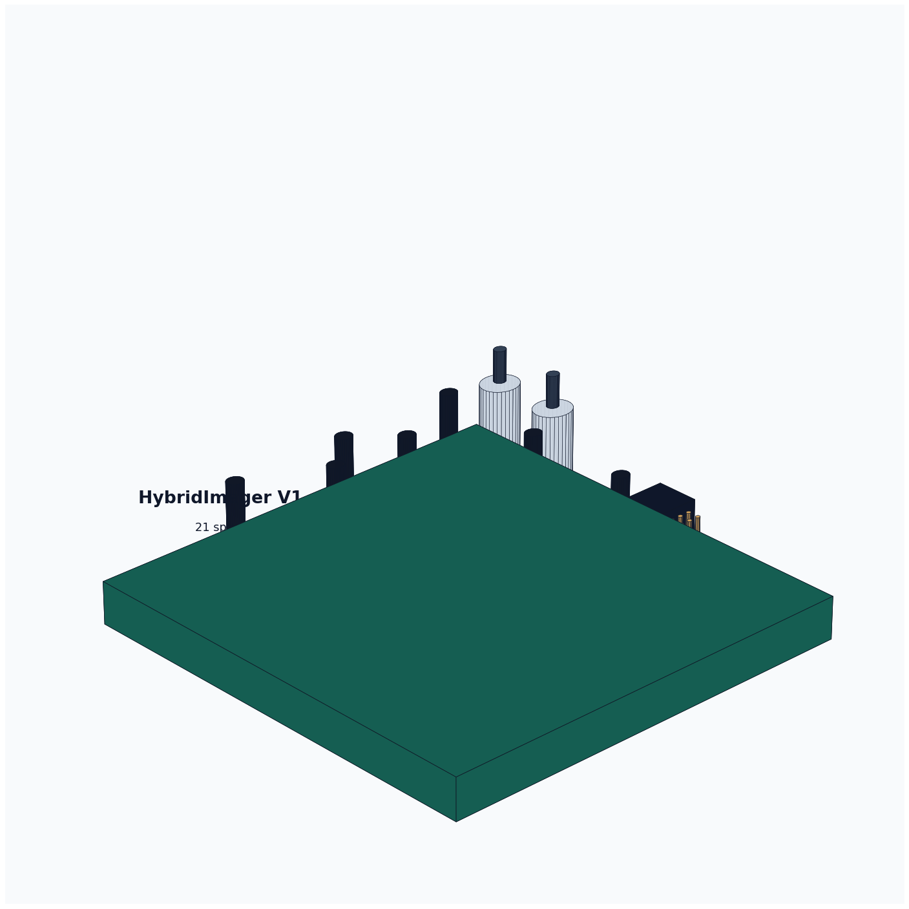

# HybridImager V1 Weiqi Sparse Sensor Board




This is the first board-level HybridImager sensor draft. It deliberately uses a
**sparse multi-site single-pixel detector array** instead of one central bucket
only. The geometry follows a Weiqi-like 7x7 conceptual grid with 21 populated
detector sites.

## Immediate Scope

- Validate detector spacing and sparse reconstruction geometry.
- Provide per-site signal pads for external TIA/comparator experiments.
- Reserve board area for three TIA banks, one timestamp MCU/FPGA, sync SMA
  connectors, power/sync header, and a 2x20 expansion header.
- Keep V1 buildable and inspectable before committing to dense custom sensor
  electronics or ASIC work.

## Files

- `hybridimager-v1-weiqi-sensor.kicad_pcb`: generated KiCad board.
- `hybridimager-v1-weiqi-sensor.kicad_pro`: KiCad project file.
- `hybridimager-v1-weiqi-sensor.kicad_sch`: board-first schematic stub.
- `hybridimager-v1-source-dataset.json`: source assumptions and design dataset.
- `hybridimager-v1-bom.csv`: draft BOM.
- `artifacts/hybridimager-v1-full-view-render.png`: generated full-view 3D concept render.
- `artifacts/hybridimager-v1-kicad-render-full.png`: KiCad-native zoomed-out render.
- `artifacts/hybridimager-v1-kicad-render-close.png`: KiCad-native closer render.
- `artifacts/hybridimager-v1-weiqi-sensor.step`: STEP export.
- `gerber/`: Gerber and drill outputs.

## Reproduce

```bash
python3 scripts/generate_v1_weiqi_sensor_board.py
kicad-cli pcb upgrade hardware/v1-weiqi-sensor/hybridimager-v1-weiqi-sensor.kicad_pcb
kicad-cli pcb drc --format json --severity-all -o hardware/v1-weiqi-sensor/artifacts/drc.json hardware/v1-weiqi-sensor/hybridimager-v1-weiqi-sensor.kicad_pcb
kicad-cli pcb export step --force --include-pads --include-tracks --include-silkscreen --include-soldermask -o hardware/v1-weiqi-sensor/artifacts/hybridimager-v1-weiqi-sensor.step hardware/v1-weiqi-sensor/hybridimager-v1-weiqi-sensor.kicad_pcb
kicad-cli pcb export gerbers --layers F.Cu,B.Cu,F.SilkS,B.SilkS,F.Mask,B.Mask,Edge.Cuts,F.Fab,B.Fab --precision 6 --check-zones -o hardware/v1-weiqi-sensor/gerber hardware/v1-weiqi-sensor/hybridimager-v1-weiqi-sensor.kicad_pcb
kicad-cli pcb export drill --generate-map --map-format svg --generate-report --report-path hardware/v1-weiqi-sensor/artifacts/drill-report.txt -o hardware/v1-weiqi-sensor/gerber hardware/v1-weiqi-sensor/hybridimager-v1-weiqi-sensor.kicad_pcb
xvfb-run -a kicad-cli pcb render --output hardware/v1-weiqi-sensor/artifacts/hybridimager-v1-kicad-render-full.png --width 1800 --height 1200 --background opaque --quality high --floor --perspective --rotate 315,0,35 --zoom 1.0 hardware/v1-weiqi-sensor/hybridimager-v1-weiqi-sensor.kicad_pcb
```

## Engineering Status

Current generated validation: KiCad DRC reports 0 violations and 0 unconnected
items after running the commands above.

This is still an engineering draft. It is useful for visual review, mechanical
planning, sparse-detector geometry, and next-step analog partitioning. It still
needs a detailed schematic, selected photodiode parts, TIA gain/noise analysis,
layout review, and fabrication review before ordering boards.
