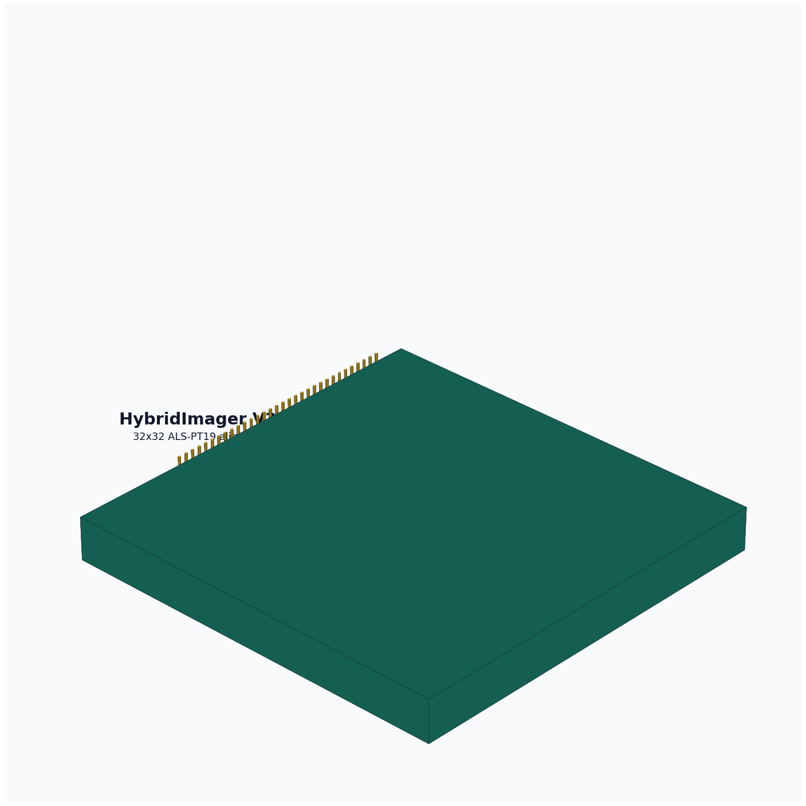
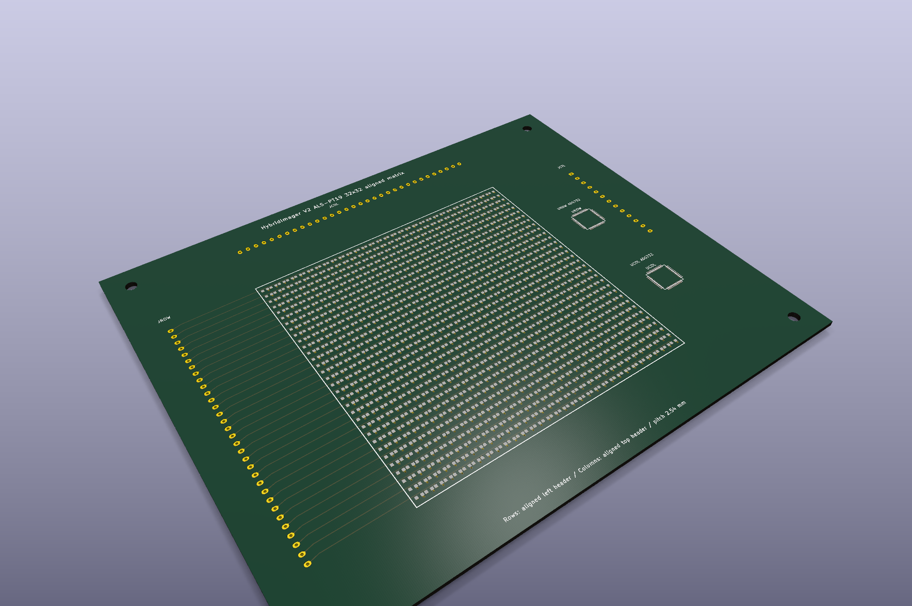

# HybridImager V2 ALS-PT19 32x32 Aligned Sensor Board





V2 moves from the sparse V1 detector carrier to a dense `32x32` matrix using
the same `ALS-PT19` phototransistor family documented in `CustomSensor`.

## What Changed From V1

- `1024` ALS-PT19 detector sites instead of 21 sparse sites.
- Unrotated footprints on a `2.54 mm` pitch so pins are aligned and pads do not overlap.
- Row pins align to the left edge header; column pins align to the top edge header.
- Row nets route horizontally on `F.Cu`; column nets route vertically on `B.Cu`.
- ADG732 row/column mux footprints remain as placement placeholders for the CustomSensor addressing model.

## Files

- `hybridimager-v2-als-pt19-32x32.kicad_pcb`: generated KiCad board.
- `hybridimager-v2-als-pt19-32x32.kicad_pro`: KiCad project file.
- `hybridimager-v2-als-pt19-32x32.kicad_sch`: board-first schematic stub.
- `hybridimager-v2-source-dataset.json`: source assumptions and CustomSensor reference dataset.
- `hybridimager-v2-bom.csv`: draft BOM.
- `artifacts/hybridimager-v2-full-view-render.png`: generated full-view 3D concept render.
- `artifacts/hybridimager-v2-kicad-render-full.png`: KiCad-native zoomed-out render.
- `artifacts/hybridimager-v2-kicad-render-close.png`: KiCad-native closer render.
- `artifacts/hybridimager-v2-als-pt19-32x32.step`: lightweight board-level STEP export.
- `gerber/`: Gerber and drill outputs.

## Reproduce

```bash
python3 scripts/generate_v2_als_pt19_32x32_board.py
kicad-cli pcb upgrade hardware/v2-als-pt19-32x32/hybridimager-v2-als-pt19-32x32.kicad_pcb
kicad-cli pcb drc --format json --severity-all -o hardware/v2-als-pt19-32x32/artifacts/drc.json hardware/v2-als-pt19-32x32/hybridimager-v2-als-pt19-32x32.kicad_pcb
kicad-cli pcb export step --force -o hardware/v2-als-pt19-32x32/artifacts/hybridimager-v2-als-pt19-32x32.step hardware/v2-als-pt19-32x32/hybridimager-v2-als-pt19-32x32.kicad_pcb
kicad-cli pcb export gerbers --layers F.Cu,B.Cu,F.SilkS,B.SilkS,F.Mask,B.Mask,Edge.Cuts,F.Fab,B.Fab --precision 6 --check-zones -o hardware/v2-als-pt19-32x32/gerber hardware/v2-als-pt19-32x32/hybridimager-v2-als-pt19-32x32.kicad_pcb
kicad-cli pcb export drill --generate-map --map-format svg --generate-report --report-path hardware/v2-als-pt19-32x32/artifacts/drill-report.txt -o hardware/v2-als-pt19-32x32/gerber hardware/v2-als-pt19-32x32/hybridimager-v2-als-pt19-32x32.kicad_pcb
xvfb-run -a kicad-cli pcb render --output hardware/v2-als-pt19-32x32/artifacts/hybridimager-v2-kicad-render-full.png --width 1800 --height 1200 --background opaque --quality high --floor --perspective --rotate 315,0,35 --zoom 0.95 hardware/v2-als-pt19-32x32/hybridimager-v2-als-pt19-32x32.kicad_pcb
```

## Engineering Status

Current generated validation: KiCad DRC reports 0 violations and 0 unconnected
items. Full-detail STEP with pad/track solidification is intentionally avoided
for this dense 1024-sensor matrix because it is much slower; use Gerbers for
electrical manufacturing geometry and the lightweight STEP for mechanical board
outline review.

This is a dense matrix layout draft, not a fabrication-approved design. It
still needs final ADG732 schematic wiring, optical masking/baffling decisions,
row/column crosstalk review, solderability review, and firmware pin mapping.
