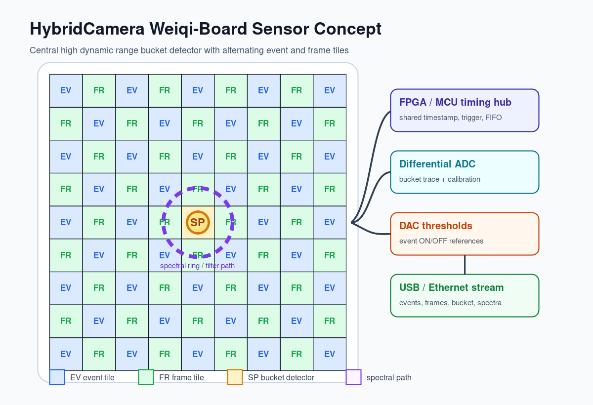
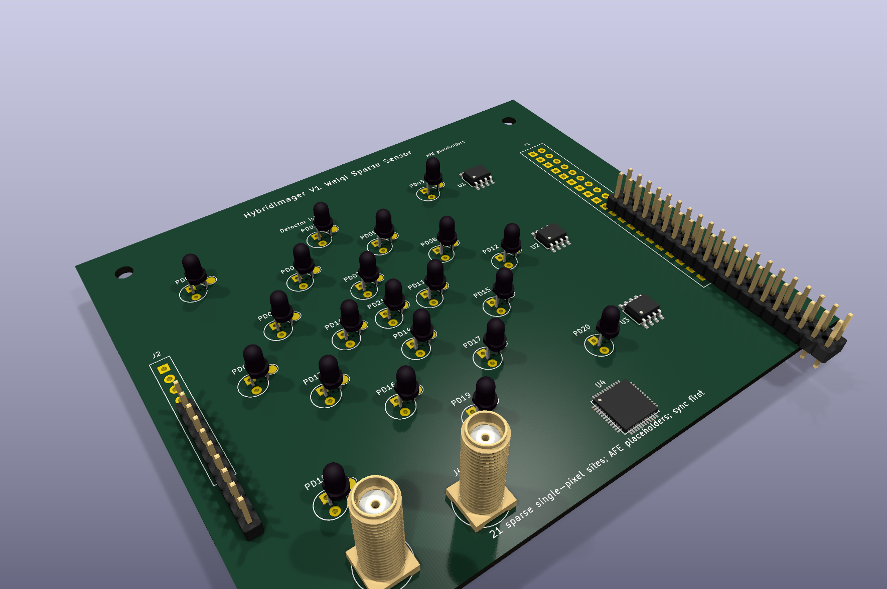

[English](../README.md) · [العربية](README.ar.md) · [Español](README.es.md) · [Français](README.fr.md) · [日本語](README.ja.md) · [한국어](README.ko.md) · [Tiếng Việt](README.vi.md) · [中文 (简体)](README.zh-Hans.md) · [中文（繁體）](README.zh-Hant.md) · [Deutsch](README.de.md) · [Русский](README.ru.md)

[](https://github.com/lachlanchen/lachlanchen/blob/main/figs/banner.png)

# HybridImager

*単一画素、イベント、フレーム、スペクトル計測を一つの保守しやすい研究スタックにまとめる、オープンなハイブリッド科学イメージング。*

[](https://lazying.art)
[](../publications/hybrid_camera_concept.pdf)
[](../publications/open_camera_project_survey.pdf)
[](https://github.com/sponsors/lachlanchen)

HybridImager は、混合型科学検出器のための研究・設計ワークスペースです。高ダイナミックレンジの単一画素バケット検出器、イベントカメラのタイミング、フレームカメラのテクスチャ、任意のスペクトル測定を、一つの同期データモデルで扱います。

| Donate | PayPal | Stripe |
| --- | --- | --- |
| [](https://chat.lazying.art/donate) | [](https://paypal.me/RongzhouChen) | [](https://buy.stripe.com/aFadR8gIaflgfQV6T4fw400) |

## システム概念



- **単一画素ブランチ:** 絶対強度、高ダイナミックレンジ、スペクトルまたは符号化測定のための中央低ノイズ検出器/TIA 経路。
- **イベントブランチ:** まず商用イベントカメラで非同期の時間コントラストを使い、実用化できる段階でオープンな FPGA インターフェイスへ進む。
- **フレームブランチ:** テクスチャ、較正、人が読める確認のためのグローバルシャッターフレームモジュール。
- **融合レイヤー:** 露光、ゲイン、較正プロファイル、トリガー、パターン情報を含むタイムスタンプ付きストリーム。

## V1 センサーボード



最初の基板ドラフトは KiCad で生成した **囲碁風の疎なセンサーキャリア**で、中央の bucket 1個だけではなく 21 個の単一画素検出器サイトを持ちます。各サイトの信号パッド、明示的なグラウンド配線、3 個の AFE プレースホルダー、QFN タイミングプレースホルダー、SMA 同期入出力、電源/同期ヘッダー、2x20 拡張ヘッダーを含みます。

レビューパッケージ: [`hardware/v1-weiqi-sensor/`](../hardware/v1-weiqi-sensor/) には KiCad 基板、データセット、BOM、クリーンな DRC、STEP、Gerber、ドリルファイル、全体レンダーが含まれます。

## 現在の内容

| 領域 | 場所 |
| --- | --- |
| コンセプト論文 | `publications/hybrid_camera_concept.pdf` |
| オープンカメラ調査 | `publications/open_camera_project_survey.pdf` |
| V1 疎センサーボード | `hardware/v1-weiqi-sensor/` |
| 研究ノート | `references/` |
| 決定的に生成される図 | `figures/hybrid_board_layout.*`, `figures/hybrid_signal_chain.*` |
| ハードウェア計画 | `hardware/board_architecture.md` |
| 再構成計画 | `algorithms/reconstruction_plan.md` |
| 以前の文脈 | `copied-context/` |
| オープンプロジェクトのミラー | `external/` の git submodule |

## クイックスタート

```bash
git clone --recurse-submodules https://github.com/lachlanchen/HybridImager.git
cd HybridImager
make all
```

すでに clone 済みの場合:

```bash
git submodule update --init --recursive
make survey
```

## 研究ベースライン

単一画素の最も強いオープン経路は **ONE-PIX** と **ONE-PIX_hardware** です。イベントビジョンでは、最初の現実的な構成として商用イベントカメラと **OpenEB**、**jAER**、**v2e**、**E2VID** を使います。フレームハードウェアでは **OneInchEye**、**Antmicro OV9281**、**AXIOM Beta**、**Seeed reCamera** が有用なオープン参照です。

このプロジェクトは初期段階からカスタムイベントセンサー ASIC を前提にしません。まず基板レベルの同期、オープンなデータ形式、再現可能な再構成、再利用できる機械/PCB 参照から始めます。

## CAD とハードウェアの注意

編集可能な機械設計に推奨する Shapr3D の出力:

```text
STEP + native .shapr + Parasolid + DXF from sketch + 3MF/STL preview
```

STEP を主な交換形式、Parasolid を高忠実度のソリッドバックアップ、DXF を 2D 外形や板材用、STL/3MF を印刷またはメッシュプレビュー専用として使います。

## ビルドコマンド

```bash
make figures
make paper
make survey
make all
make clean
```

## 引用

研究で HybridImager を使用する場合は、このリポジトリを引用してください。GitHub は [CITATION.cff](../CITATION.cff) を読み取り、リポジトリページに **Cite this repository** パネルを表示します。

```bibtex
@software{chen_hybridimager_2026,
  author = {Chen, Lachlan},
  title = {HybridImager: Open Hybrid Scientific Imaging Research Workspace},
  year = {2026},
  url = {https://github.com/lachlanchen/HybridImager}
}
```

## 状態

これは初期研究ワークスペースであり、認証済みのイメージング製品ではありません。直近の目的は、光学・顕微鏡実験のための保守可能なパイプラインを作ることです。入手可能なモジュールで構築し、きれいに同期し、再現可能に再構成し、データ契約が安定してから専用ハードウェアを統合します。

少なく作る。もっと撮る。
